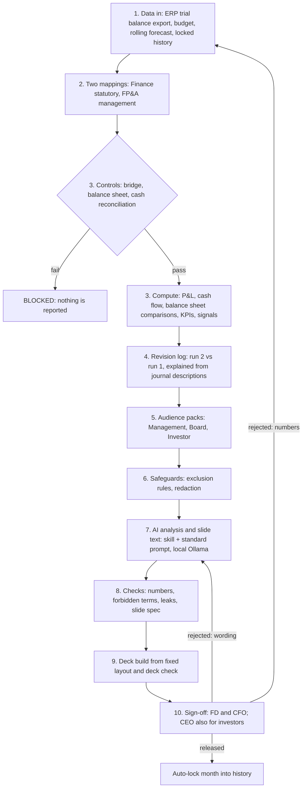

# FP&A Automated Variance, KPI & Executive Narrative Engine

An open-source, zero-licence-cost automation for **Financial Planning & Analysis (FP&A)**. After the finance close, it turns a
trial balance export into budget and forecast comparisons, KPIs and cash analysis, then drafts analysis and a PowerPoint deck for
**Management, the Board and Investors** using a local AI model (Ollama), while enforcing disclosure controls and PDPA-style redaction.

> **All data in this repository is synthetic.** Customer names, emails, phone and bank numbers are fake and exist only to demonstrate redaction.

---

## 1. Why this exists

After the close, FP&A has days, not weeks, before management, the Board and investors expect a pack. Most of that time goes into
populating comparisons, recomputing ratios and rewriting the same story three times. This engine automates the mechanical work so
FP&A can spend the time on **insight**: why the numbers moved and what to do next.

| Your manual step after the close | What the engine does | Who still acts |
| :--- | :--- | :--- |
| 1. Closed management report (BS, P&L, CF) and budget | Reads the ERP trial balance export, budget and rolling forecast; derives the balance sheet and cash flow | Finance drops the export |
| 2. Populate actuals against budget and forecast | Month, quarter-to-date and year-to-date comparisons for P&L, cash flow and balance sheet | - |
| 3. Compute KPIs and ratios | KPI scorecard against targets, DSO/DPO/drag, cash KPIs | FP&A owns the targets |
| 4. Variance analysis (BvA, RFvA, MoM, QoQ, YoY) | All horizons, favorable/unfavorable, two-sided materiality, rule-based signals | - |
| 5. Commentary in PowerPoint per audience | AI drafts analysis and slide text; a script builds a fixed-layout deck from engine data | FP&A adds driver notes and reviews |
| 6. Finance Director and CFO approval, loop back if adjusted | One-click approvals per role; CEO also required for the investor deck; rejections are logged and routed | Approvers |

## 2. Workflow



**Run numbering is automatic.** The first export for a period is run 1 (first draft). A different export for the same period is run 2 and is compared
with run 1. Dropping the same file again keeps the run number (for example after adding notes).

## 3. Design decisions (agreed with the CFO)

1. **Numbers are never produced by the AI.** The engine computes every figure, KPI status and signal. The AI interprets; every figure it writes is checked against the pack.
2. **Two mappings, two owners.** Finance owns the statutory mapping (Board and investors). FP&A owns the management mapping and reclass rules (20% of engineering payroll and 30% of admin overhead apportioned to cost of revenue; management only). Operating profit must be identical on both bases.
3. **Audience policy** (`config/audience_policy.csv`, `config/exclusion_rules.csv`, editable):

| | Management | Board | Investor |
| :--- | :--- | :--- | :--- |
| Basis | management (business units, adjusted gross margin) | statutory | statutory, totals only |
| Comparisons | all | all | budget, QoQ, YoY (no rolling forecast, no MoM) |
| Statements | P&L, cash flow, balance sheet | P&L, cash flow, balance sheet | P&L totals and KPIs |
| KPIs | all | all | margins, opex %, growth, DSO/DPO/drag |
| Redaction | none | personal data (names of customers kept) | everything |
| Revision note | yes | one line | no |
| Approvals | Finance Director + CFO | Finance Director + CFO | Finance Director + CFO, then CEO |

4. **Raw ledger memos are management-only.** Driver notes reach the Board and investors only when marked `External_OK = Yes`, and are redacted first.
5. **The revision log is internal** (Finance and FP&A). It never enters any pack.
6. **Google Sheets** is a front end for people-owned inputs only (driver notes, revision reasons, mappings, KPI targets). Files remain the system of record: locked history, sign-off state, exclusion rules, entity master and packs are never in Sheets.
7. **Deck method (baseline):** the AI writes slide titles and bullets as JSON; a script fills a fixed layout. Tables and KPI tiles come from engine data (already filtered for the audience), so a deck cannot show more than its audience's pack.

## 4. Keeping the workload low (the three touchpoints)

| Touchpoint | Effort |
| :--- | :--- |
| 1. Drop the ERP export (Day 3, and again after adjustments on Day 4) | No Period/Version columns, no renaming; ERP headers are mapped once in `config/erp_column_map.csv` |
| 2. Add driver notes for the lines the engine lists as needing one | One cell per line plus an `External_OK` flag |
| 3. Review the three outputs once and approve | One click per approver; a rejection needs one line of reason |

Everything else is automatic: run numbering, revision log (changes are explained from the ERP **journal description**; a manual reason is optional; only a change above
$10,000 with no explanation blocks), AI call, redaction, checks, deck build, history lock on final approval.

## 5. Repository structure

```text
fpa-automation-showcase/
├── config/
│   ├── coa_statutory.csv, coa_management.csv, mgmt_reclass_rules.csv   # the two mappings and reclass rules
│   ├── audience_policy.csv, exclusion_rules.csv, entity_master.csv     # disclosure policy and redaction deny-list
│   ├── analyst_skill.md        # shared senior analyst skill (limit 6,000 characters, enforced by a test)
│   ├── audience_cards.md       # short style card per audience (limit 800 characters each)
│   ├── standard_prompt.md      # one prompt for every audience; defines the JSON the AI must return
│   ├── erp_column_map.csv      # your ERP's headers -> internal names
│   └── deck_template.pptx      # OPTIONAL: your own theme; a plain 16:9 default is used if absent
├── data/
│   ├── generate_mock_data.py   # builds all mock inputs (deterministic)
│   ├── input/                  # trial_balance.xlsx (Day 3), samples/, budget, forecast, driver_notes, revision_reasons, kpi_targets, sheets_inputs.xlsx
│   └── history/                # actuals_history.csv (locked months), restatement_log.csv
├── engine/                     # one module per stage, every function documented
│   ├── ingestion.py  mapping.py  reconciliation.py  statements.py  variance_ratios.py
│   ├── kpi.py  signals.py  revision_log.py  runs.py  packs.py  anonymizer.py
│   ├── llm_narrative.py  validation.py  deck.py  signoff.py  history.py  pipeline.py
├── main.py                     # command line
├── app.py                      # Streamlit dashboard
├── tests/                      # 79 Python tests (engine + dashboard)
├── test.js                     # Node integration runner (16 checks against the real command line)
├── run_app.bat / run_app.sh    # one-click launchers
└── requirements.txt
```

## 6. Inputs

* **Trial balance export** (Excel): `Account Code`, `Account Name`, `Business Unit`, `Balance`, `Journal Description` (map your own headers in `config/erp_column_map.csv`).
  P&L accounts carry the month's activity; balance sheet accounts carry closing balances; retained earnings is the **opening** balance (the month's earnings are added by the engine).
* **Budget / rolling forecast** (Excel, long format): `Period, ERP_Account_Code, BU, Amount` (forecast also `Forecast_Version`). Both include balance sheet accounts.
* **Locked history** (`actuals_history.csv`): months already closed and signed off. Never overwritten.
* **People-owned tables** (CSV or the Sheets workbook): driver notes (`Period, Applies_To, Note, External_OK`), revision reasons (optional), KPI targets (`KPI, Direction, Target, Tolerance_Pct, Visible_To`).
  `Applies_To` should equal the statutory line name (for example `Cost of Revenue`) so the engine can tell which material lines still need a note.

### Google Sheets

Run `python data/generate_mock_data.py`, then **File > Import** `data/input/sheets_inputs.xlsx` into Google Sheets. Keep `Period` and `ERP_Account_Code` as plain text.
Edit, then **File > Download > Microsoft Excel (.xlsx)** and run `python main.py --sheets-workbook <file>.xlsx --mock`. The engine repairs a Period that Sheets converted to a date
(with a warning) and trims stray spaces. Use synthetic data in a personal account; real data belongs in a company tenant.

## 7. Metrics and formulas

| Metric | Formula |
| :--- | :--- |
| Variance | Actual - Comparator. Variance % = Variance / absolute Comparator; shown as n/a when the comparator is zero |
| Materiality | absolute variance >= $25,000 **and** >= 5% (when the percentage cannot be computed, the dollar test decides) |
| Favorable | revenue, profit, cash and operating cash flow higher is better; COGS, OpEx and receivables lower is better |
| Gross margin % | (Revenue - COGS) / Revenue. **Adjusted gross margin** (management only) applies the reclass rules |
| DSO / DPO | AR / Revenue x days; AP / COGS x days, using the **actual days in the period** (30, or 91 for a quarter) |
| Working capital drag | DSO - DPO |
| Operating cash flow | Net income + depreciation - change in receivables - change in prepaid + change in payables + change in accrued expenses |
| Free cash flow / runway | Operating + investing cash flow; runway = cash / average monthly burn of the last 3 months (n/a when cash generative) |
| QoQ | quarter to date versus the same months of the prior quarter (balance sheet: same position last quarter) |

## 8. Controls (hard stops return `BLOCKED` and report nothing)

| Control | Stops when |
| :--- | :--- |
| Control totals / unmapped accounts | any raw amount does not reach both mapped views, or any account is unmapped |
| Bridge | operating profit differs between the statutory and management bases in any scenario or month |
| Balance sheet | assets differ from liabilities + equity + current earnings |
| Cash reconciliation | derived net cash flow differs from the change in cash |
| Stale file | the export has a different period, or its P&L is identical to last month's |
| Revision log | a changed line above the threshold has no explanation |
| History | a locked month is re-run (use `restate_period`: reason + Finance Director approval, logged) |

## 9. The AI step

* **Skill + card + facts + standard prompt** are rendered into one Markdown pack per audience (`outputs/<run>/packs/`). The prompt is last because that is what a model reads most recently.
* **Output is JSON**: `commentary`, `analysis` (headline, key variances, drivers, unexplained, questions) and `slides` (layout, title, bullets). Mock mode produces the same structure from the data, so the whole workflow can be demonstrated offline.
* **Context window.** Ollama's default context is small and truncates silently, which looks like hallucination. The engine sends `num_ctx` in JSON mode through the native API and warns in the review list when a prompt is close to it, naming a concrete minimum, e.g. *"prompt is about 9,400 tokens... raise it to at least 11,448"*. The dashboard's context window control is a fixed set of preset sizes (2048 up to 131072), not a free-typed number, both because Ollama's own context sizes are normally powers of two and to make the fix for that warning mechanical: move the slider to the next preset **above the suggested minimum**, not just above the prompt size. That distinction matters: `num_ctx` is a budget shared by the prompt **and** the model's reply together, so raising it to barely more than the prompt leaves the model no room to actually write its commentary, analysis and slides.
* **A failed live call is never silent**: the text is labelled `[FALLBACK ... NOT AI OUTPUT]` and mode is `MOCK_FALLBACK`. The dashboard also shows the real exception message next to it, and a "Test Ollama connection" button lists what is actually installed.
* **Other AI platforms.** Management can use any platform: upload a pack file, ask for the JSON the standard prompt specifies, save it, then run
  `python main.py --ai-json Board=board.json` (repeatable per audience). The output goes through the same redaction, checks and deck build.

### What to expect from a live model, versus the mock

The mock AI is deterministic template text built only from pack rows; it exists for offline demos and CI. A live
model is a real generative writer, so its wording, structure and even how many slides it produces will **not**
match the mock, and that is expected, not a defect. Two things can make a live run's "Needs your attention" list
longer than the mock's (which is always clean by construction):

* **Figure not found in pack.** This fires when the model computed or rounded a number itself (a delta, a sum, a
  percentage) instead of copying a figure from the Facts section verbatim, which `analyst_skill.md` explicitly
  forbids. A long list of these is the control doing its job, catching exactly the kind of invented number this
  system exists to prevent, not a bug to be "fixed" by loosening the check. If a model produces many of these, it
  is a sign that model is not following instructions tightly enough for this task; see the model recommendation
  below for one that was tested clean.
* **Slide count.** A model can also ignore "at most 7 slides." That is flagged for review, and separately, the
  deck builder itself will never include more than `MAX_SLIDES` slides regardless of what the model returned, so
  an oversized AI reply cannot produce an oversized deck.

In both cases, the flagged list is the review step working as intended: live AI drafts are meant to be checked by
FP&A before release, not approved unread. A clean run (the mock, or a strong model on a well-scoped prompt) should
show nothing under "Needs your attention" beyond missing driver notes.

### Model recommendation (user-validated)

`llama3.2` (the default in `config.py`, a small ~3B model) produced two live `LIVE` outputs and two `MOCK_FALLBACK`
outputs across the three audiences in testing, with several "figure not found" flags on the ones that did come
back live — consistent with the pattern above. **`gemma4:26b`** (Google's Gemma 4, the 26B Mixture-of-Experts
variant, released April 2026 — after this project's own knowledge cutoff, so it was not available to recommend
when this engine was first built) was then tested on the same packs and produced a fully clean run: all three
audiences `LIVE`, stage 8 (numbers, forbidden terms, leaks, slide spec) clean for all three, and all three decks
built with no overflow and no number mismatches. If you have the memory for it, `gemma4:26b` is the better-tested
choice for this workload; `llama3.2` is the lighter but less reliable fallback for very constrained hardware.

**A hardware note worth flagging plainly.** Published sizing for `gemma4:26b` (Google's own quantization table,
a Hugging Face benchmark, and independent Ollama setup guides) consistently puts it at roughly 17-20GB once
loaded, and several explicitly describe it as tight even on a 24GB machine; one guide's own hardware table routes
a 16GB-RAM laptop to the much smaller `gemma4:e2b` instead. It was nonetheless run successfully here on a laptop
with 16GB of *total* system RAM (confirmed, not a larger machine with 16GB set aside for a VM or GPU). The likely
explanation is that Ollama/llama.cpp memory-maps the model file rather than loading all of it into RAM at once,
and that a Mixture-of-Experts architecture may only need to keep each prompt's active experts resident rather
than the full 26B, which a single sequential `generate` call per audience (not a long interactive chat session)
would exercise fairly lightly — but this is a plausible explanation, not a confirmed one, since actual memory
usage during the run was not captured. If you try `gemma4:26b` on a similarly tight machine, watch Activity
Monitor/Task Manager for swapping, close other memory-heavy applications first, and fall back to `gemma4:e2b`
or `llama3.2` if it struggles.

## 10. Roll-forward each month

1. After the final approval the month is **appended to locked history automatically** and never overwritten.
2. Next month starts from a **fresh export**; nothing is copied from last month's file.
3. Budget is fixed for the year; each month uses the latest rolling forecast version.
4. Mappings carry effective dates, so a July change never rewrites June.
5. Driver notes are per period, so last month's causes are not reused.
6. Restating a closed month needs a logged reason and Finance Director approval.

## 11. Setup (no programming experience needed)

1. Install **Python 3.10+** from python.org (Windows: tick *Add python.exe to PATH*). Optional: **Node.js LTS** for `test.js`.
2. Download this repository as a ZIP and unzip it to your Desktop.
3. Open a terminal in the folder and run `pip install -r requirements.txt`, then `python data/generate_mock_data.py`.
4. Start the dashboard: double-click `run_app.bat` (Windows) or `run_app.sh` (macOS/Linux), or run `streamlit run app.py`.
5. Demo flow: choose **Day 3 sample** and press *Run*, then choose **Day 4 sample** and press *Run* (it is detected as run 2). Approve as Finance Director, CFO and CEO.
6. For live AI: install Ollama, run `ollama pull llama3.2`, switch off *Mock AI* in the sidebar.

Command line examples:

```bash
python main.py --mock                                      # Day 3 file with the offline AI
python main.py --mock --tb-file data/input/samples/day4_trial_balance.xlsx
python main.py --abs 50000 --rel 0.10 --mock               # change materiality
python main.py --mock --demo-approve                       # simulate approvals (locks the month on release)
node test.js                                               # integration tests (set PYTHON=... if needed)
python -m unittest discover -s tests                       # Python tests
```

## 12. Testing and quality-check log

**Results:** 91 Python tests (engine and dashboard) and 17 Node integration checks pass against the pinned `requirements.txt`
(pandas 2.2.1, numpy 1.26.4, Streamlit 1.32.0, openpyxl 3.1.2, python-pptx 1.0.2).
Decks were also rendered through LibreOffice and inspected visually.

**Defects in the original code, now fixed and protected by tests**

| # | Defect | Fix |
| :-- | :--- | :--- |
| 1 | Unmapped accounts were dropped silently by the groupby | Kept in an `UNMAPPED` bucket; the run is blocked |
| 2 | Audit warnings printed to stdout broke the JSON the Node test parses | Logging goes to stderr; stdout is clean JSON |
| 3 | Zero budget produced absurd percentages (`replace(0, 1)`) | Percent is n/a; the dollar test decides materiality |
| 4 | No favorable/unfavorable logic | Direction depends on the line's category |
| 5 | Mock narratives contained hard-coded claims | Mock text is assembled only from pack data |
| 6 | Live Ollama failure silently returned mock text; `ollama` package missing | HTTP API, explicit `MOCK_FALLBACK` label |
| 7 | Materiality tested budget only; DSO/DPO used a fixed 30 days; no time dimension | All horizons; actual days; long-format fact table |
| 8 | Redaction ran on the output, after the model had seen the data | Redaction before the AI, plus a second pass on the output |
| 9 | `python3` hard-coded in the Node test (fails on Windows) | Detects `python3`, `python` or `py` |

**Issues found during this build by the test suite**

| # | Finding | Fix |
| :-- | :--- | :--- |
| 10 | Instructions to the Board and investor packs named management-only concepts ("never mention adjusted gross margin..."), which reveals they exist | Generic scope wording; horizon definitions only for horizons present in a pack |
| 11 | Investor pack received the revision note | Policy column controls it (Management and Board only) |
| 12 | The shared skill said "forecast", putting the word into the investor pack | Reworded; a test asserts the investor pack never contains it |
| 13 | A stray comma in a config CSV crashed with a raw traceback | Clear error naming the file; the cell was fixed |
| 14 | The mock's own slides broke the slide limits (5 bullets, a bullet over 160 characters) | Caught by the slide spec check; mock now clips and caps |
| 15 | Missing KPI values came out as NaN instead of None | Normalised |
| 16 | A one-sided $500 P&L change was blocked by the balance sheet control | Working as designed; a balanced small change is auto-logged |
| 17 | DSO 44.8, DPO 28.1 but drag 16.8 on the page (rounding) | Days shown to two decimals |
| 18 | Sheets can turn `2026-06` into a date, hiding driver notes silently | Periods repaired with a warning; text trimmed |

**Issues found during user acceptance testing, round 1**

| # | Finding | Fix |
| :-- | :--- | :--- |
| 19 | KPI scorecard looked identical across audiences; Adjusted Gross Margin existed only as a row in the text pack's ratio table, never as a KPI the scorecard knew about | Added as its own KPI (`Adjusted_Gross_Margin_%`), visible to Management only, computed from the management-basis figures |
| 20 | `st.write()` on commentary full of `$` let Streamlit auto-render pairs of `$` as LaTeX: spaces vanished ("vs budget" -> "vsbudget") and numbers rendered in an italic math font | Escaped markdown-special characters before rendering |
| 21 | Comparison explorer highlighted material rows with a solid light-yellow background and no explicit text colour: invisible on Streamlit's dark theme | Switched to a theme-agnostic highlight: bold coloured text, never a background fill |
| 22 | A failed live Ollama call gave only a generic "unavailable or invalid reply" label with no way to diagnose it | Dashboard now shows the real exception message; added a "Test Ollama connection" button; JSON parsing tolerates a model wrapping its reply in prose; timeouts are retried |

**Issues found during user acceptance testing, round 2**

| # | Finding | Fix |
| :-- | :--- | :--- |
| 23 | "Operating expenses as % of revenue" was identical for Management and Board; like #19, it was computed from the statutory basis only, even though the management reclass structurally lowers it | Added `Adjusted_Opex_%_of_Revenue` (management-only), mirroring the Adjusted Gross Margin fix |
| 24 | Cash runway's tile still showed as truncated ("Cash gener…") after round 1 shortened the text; `st.metric`'s value box clips at a fixed width regardless of content | Tile now shows a short "N/A" with the explanation in a hover tooltip (`help=`), for any KPI with no numeric value, not just runway |
| 25 | The context window control was a free-typed number, which allows invalid or inefficient sizes | Changed to a preset slider (2048 up to 131072); README explains how to act on the "prompt is close to the window" warning |
| 26 | **Regression in round 1's own fix:** escaping the *entire* composed slide-title string also escaped the app's own `**title**` / `_(layout)_` markup, so titles rendered as literal asterisks and underscores instead of bold/italic | Split into `escape_md()` (escapes only the AI's raw text) and compose the app's own markdown markup afterward, so our formatting still renders while the AI's `$`/`_`/`*` still show up literally |
| 27 | A live model's draft did not resemble the mock's output, and a long "Needs your attention" list for a live run looked like something was broken | Clarified in this README: the mock is deterministic template text and will never match live prose; a long review list is usually the number/slide-spec checks correctly catching a model computing its own figures or exceeding the slide limit. Added defensive slide-count clipping in the deck builder itself, so an oversized AI reply can never produce an oversized deck regardless of what was flagged |
| 28 | The context-window warning said "close to the window; raise num_ctx" with no concrete target, inviting a fix that raises it to barely above the prompt size — which leaves no room for the model's own reply, since `num_ctx` is a budget shared by the prompt and the output together | Warning now states a concrete minimum (prompt tokens plus 2048 reserved for the reply); the dashboard's slider tooltip explains the shared budget |
| 29 | A second, separate occurrence of the LaTeX-rendering bug (fix #20): the "Reconciliation and controls" summary embeds two money-formatted values (each containing a literal `$`) inside its own `**bold**` markup, the same pattern that broke slide titles in fix #26 — found by auditing every `st.write`/`st.markdown` call in `app.py` rather than waiting for a third occurrence to surface | Fixed with the same `escape_md()` pattern as fix #26; a dashboard test now checks this specific line so it cannot silently regress again |

**Live-model validation (user test run 3)**

With the code above in place, `llama3.2` (small, ~3B) was compared against `gemma4:26b` (Gemma 4, Google's April
2026 release, MoE variant) on the same Day 4 packs:

| Stage | `llama3.2` | `gemma4:26b` |
| :-- | :--- | :--- |
| 7 — AI analysis | Mixed: 2 of 3 audiences `LIVE`, 2 fell back to `MOCK_FALLBACK` | All 3 audiences `LIVE` |
| 8 — Automated checks | Several "figure not found in pack" and slide-spec flags on the live outputs | Clean: numbers, terms, leaks and slide spec all passed for all 3 |
| 9 — Build deck | N/A for the fallbacks | Clean: 3 decks, no overflow, no number mismatches |

This confirms the earlier diagnosis directly: the Day 4 packs, the standard prompt and the controls were not the
cause of the `llama3.2` flags — a stronger model produces a fully clean run on the exact same inputs. See "Model
recommendation" above for the hardware caveat that comes with `gemma4:26b`.

**Live-model validation (user test run 4): a single fallback, investigated**

A later run with the Model field set to `gemma4` (no tag, not the validated `gemma4:26b`) at `num_ctx=4096`
produced Management and Board as `LIVE` and Investor as `MOCK_FALLBACK` (`ValueError: No JSON object found in the
AI reply`). Worth recording how this was diagnosed, since the obvious guess (context window) didn't fit the
evidence: Management's prompt (6,084 tokens) and Board's (5,719 tokens) both already **exceeded** 4096 outright
and still came back as valid JSON, while Investor's prompt — smaller by design, since the exclusion rules strip
business-unit detail, cash flow, balance sheet and several comparison horizons for that audience — never even
triggered the "close to the window" warning (it was comfortably under the 80% threshold). A prompt that fits
easily failing while two prompts that overflowed the window both succeeded argues against context truncation as
the cause. The two differences between this run and the clean `gemma4:26b` validation above are the untagged
`gemma4` model string (which may resolve to a different, unvalidated variant) and ordinary model stochasticity —
local models do not guarantee valid structured JSON on every call, and one fallback out of three, caught and
clearly labelled rather than silently accepted, is the system behaving as designed. Raising `num_ctx` is still the
right move regardless, since Management and Board were overflowing the window and only happened to still work;
see the "Context window" note above for why the fix is to add real headroom for the reply, not just clear the
prompt size. No code defect was found or fixed here; the warning wording was clarified (see fix #28 in the next
round) so the suggested minimum is concrete and includes reply headroom instead of just "raise it."

**Full Day 3 run, end to end (user test run 5)**

A complete run 1 (Day 3 export, `gemma4:26b`, `num_ctx=16384`, 900s timeout) was carried through to a clean result:
all three audiences `LIVE`, all automated checks clean, 3 decks built with no overflow, reconciliation and the
balance sheet/cash flow controls all tying to zero. Four observations from that run changed this project directly:

* **Total wall-clock time was close to 55 minutes** for the full pipeline (three sequential live AI calls plus
  deck builds) on the 16GB-RAM laptop used for all the Gemma 4 testing so far, with no dedicated GPU mentioned.
  This is consistent with CPU-only local inference of a ~20GB model and is expected to vary significantly with
  available RAM, whether a GPU is present, and model size — it is not a fixed number this engine can promise.
  Run 2 (the Day 4 export, which re-runs all three AI calls again after the revision log) has not yet been timed
  live due to the length of run 1; expect a comparable duration.
* **`num_ctx` needed to be above 10,000** to run reliably; 16384 (already one of the slider's presets) was the
  validated value. `DEFAULT_NUM_CTX` is now **16384** (previously 8192) to reflect this directly rather than
  leaving a known-too-low figure as the out-of-the-box default.
* **900 seconds was sufficient but left little margin.** `DEFAULT_AI_TIMEOUT` is now **600 seconds** (previously
  240) as a more realistic starting point for CPU-only inference, and the dashboard's timeout control now allows
  up to 3,600 seconds (previously capped at 1,200) rather than risking an artificial ceiling below what a slower
  machine might need.
* **No charts or graphs in the output yet** — see "Limitations and next steps" below; this is acknowledged future
  scope, not a defect in this run.

**Not verified here (please confirm in your own test run)**

* Importing to and exporting from Google Sheets (the file format and the round trip through the engine are tested).
* Opening the decks in PowerPoint itself and applying your corporate template (rendered with LibreOffice only).
* Dashboard look and feel in a browser (its logic is tested headlessly).
* Whether `gemma4:26b`'s memory behaviour on a 16GB machine (see the hardware note above) holds up under longer or concurrent use, rather than the single sequential run tested here.
* A live, timed run of run 2 (the Day 4 export and its revision log) — only run 1 (Day 3) has been fully timed end to end so far.

## 13. Limitations and next steps

* The cash flow is derived (indirect method) from balance sheet movements, which needs a full balance sheet in the trial balance, budget and forecast. Tax, interest and debt are not modelled.
* Slides support five layouts (headline, variance, drivers, cash, questions). Your own template changes the theme, not the layouts.
* KPIs such as ARR, churn and burn multiple are not in a trial balance; add them through a KPI input tab if investors need them.
* Management-only measures never reach external audiences by design; the exclusion file is the place to change that, and every change should be approved.
* Open WebUI can also generate decks through add-ons, but the baseline here keeps rendering deterministic and checkable.
* **No charts or graphs yet.** Packs and decks currently present every comparison and KPI as tables and KPI tiles, not visual charts (trend lines, variance bar charts, etc.). This is an acknowledged gap, not an oversight, and is the natural next build: the engine already computes every number a chart would need (the comparison and KPI DataFrames), so adding charts means a rendering layer (e.g. matplotlib or a native python-pptx chart) on top of existing data, not new analysis.

## License

MIT
